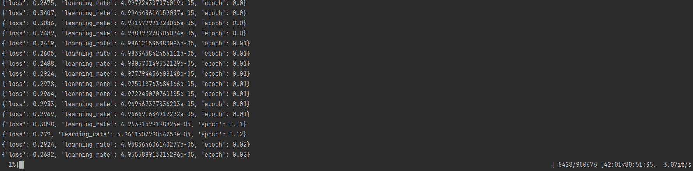

# NLP finetune

Make sure your system has the necessary tools installed for machine learning and NLP tasks:

Python: Version 3.8 or higher.
PyTorch: For running and fine-tuning the model.
Hugging Face Transformers: To use GPT-2.
Datasets Library: For loading and processing the WikiText-103 dataset.
CUDA: If you're using a GPU for faster training.


```bash 
1: System Setup
# Install pip if not installed
sudo apt-get install python3-pip

# Install PyTorch (with CUDA support if you have a GPU)
pip install torch torchvision torchaudio --index-url https://download.pytorch.org/whl/cu118

# Install Hugging Face libraries
pip install transformers datasets

# Install CUDA (Optional, if you have an NVIDIA GPU)
sudo apt install nvidia-cuda-toolkit

```
```bash
2: Load and Preprocess the Dataset
from datasets import load_dataset

# Load the dataset
dataset = load_dataset("wikitext", "wikitext-103-v1")

# Check the structure of the dataset
print(dataset)

```
```bash
python dataset.py 
README.md: 100%|██████████████████████████████████████████████████████████████████████████████████████████████████████████████████████████████████████████████████| 10.5k/10.5k [00:00<00:00, 996kB/s]
test-00000-of-00001.parquet: 100%|█████████████████████████████████████████████████████████████████████████████████████████████████████████████████████████████████| 722k/722k [00:00<00:00, 3.36MB/s]
train-00000-of-00002.parquet: 100%|████████████████████████████████████████████████████████████████████████████████████████████████████████████████████████████████| 156M/156M [00:10<00:00, 14.3MB/s]
train-00001-of-00002.parquet: 100%|████████████████████████████████████████████████████████████████████████████████████████████████████████████████████████████████| 156M/156M [00:10<00:00, 14.4MB/s]
validation-00000-of-00001.parquet: 100%|████████████████████████████████████████████████████████████████████████████████████████████████████████████████████████████| 655k/655k [00:02<00:00, 295kB/s]
Generating test split: 100%|███████████████████████████████████████████████████████████████████████████████████████████████████████████████████████████| 4358/4358 [00:00<00:00, 432010.04 examples/s]
Generating train split: 100%|███████████████████████████████████████████████████████████████████████████████████████████████████████████████████| 1801350/1801350 [00:00<00:00, 1887679.66 examples/s]
Generating validation split: 100%|████████████████████████████████████████████████████████████████████████████████████████████████████████████████████| 3760/3760 [00:00<00:00, 1441815.97 examples/s]
DatasetDict({
    test: Dataset({
        features: ['text'],
        num_rows: 4358
    })
    train: Dataset({
        features: ['text'],
        num_rows: 1801350
    })
    validation: Dataset({
        features: ['text'],
        num_rows: 3760
    })
})

```
```bash
#Tokenize the text for model input using GPT-2’s tokenizer:

from transformers import GPT2Tokenizer

# Load the GPT-2 tokenizer
tokenizer = GPT2Tokenizer.from_pretrained("gpt2")

# Tokenize the dataset
def tokenize_function(examples):
    return tokenizer(examples["text"], return_special_tokens_mask=True)

tokenized_datasets = dataset.map(tokenize_function, batched=True)

```
```bash
tokenizer_config.json: 100%|███████████████████████████████████████████████████████████████████████████████████████████████████████████████████████████████████████| 26.0/26.0 [00:00<00:00, 2.29kB/s]
vocab.json: 100%|████████████████████████████████████████████████████████████████████████████████████████████████████████████████████████████████████████████████| 1.04M/1.04M [00:00<00:00, 5.13MB/s]
merges.txt: 100%|██████████████████████████████████████████████████████████████████████████████████████████████████████████████████████████████████████████████████| 456k/456k [00:00<00:00, 29.5MB/s]
tokenizer.json: 100%|████████████████████████████████████████████████████████████████████████████████████████████████████████████████████████████████████████████| 1.36M/1.36M [00:00<00:00, 5.83MB/s]
config.json: 100%|████████████████████████████████████████████████████████████████████████████████████████████████████████████████████████████████████████████████████| 665/665 [00:00<00:00, 392kB/s]
Map: 100%|███████████████████████████████████████████████████████████████████████████████████████████████████████████████████████████████████████████████| 4358/4358 [00:00<00:00, 4781.75 examples/s]
Map:  36%|█████████████████████████████████████████████████▌                                                                                        | 647000/1801350 [01:32<02:39, 7215.22 examples/s]Token indices sequence length is longer than the specified maximum sequence length for this model (1059 > 1024). Running this sequence through the model will result in indexing errors
Map: 100%|█████████████████████████████████████████████████████████████████████████████████████████████████████████████████████████████████████████| 1801350/1801350 [04:12<00:00, 7123.00 examples/s]
Map: 100%|███████████████████████████████████████████████████████████████████████████████████████████████████████████████████████████████████████████████| 3760/3760 [00:00<00:00, 4682.16 examples/s]
DatasetDict({
    test: Dataset({
        features: ['text', 'input_ids', 'special_tokens_mask', 'attention_mask'],
        num_rows: 4358
    })
    train: Dataset({
        features: ['text', 'input_ids', 'special_tokens_mask', 'attention_mask'],
        num_rows: 1801350
    })
    validation: Dataset({
        features: ['text', 'input_ids', 'special_tokens_mask', 'attention_mask'],
        num_rows: 3760
    })
})

```




